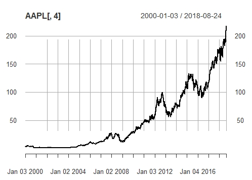
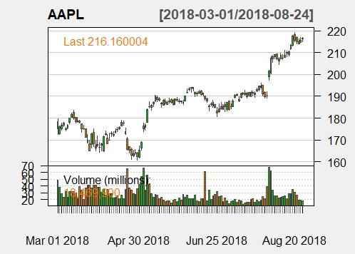
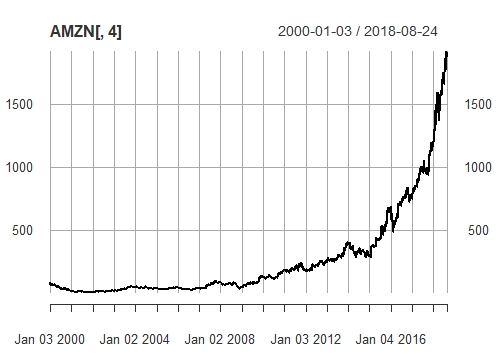
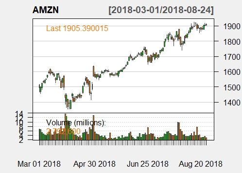
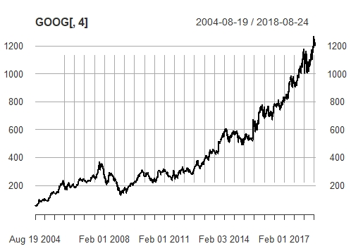
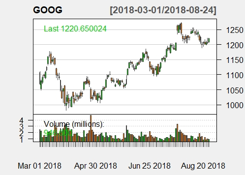

# Apple-Amazon-Google-Analysis

Very few companies can match the influence these three posses. They are the trend-makers always trying to stay ahead of the curve, and despite not being immune to changes in the economic environment, they managed to thrive during all these years. 

The archive above contains plot images, <em>xlsx</em> files with the data used in this project, and source code files. The data was obtained from [Yahoo finance](https://finance.yahoo.com/) using the [R software](https://www.r-project.org/).  

This is a common data pattern for each trading computed and stored in the database:

|    DATE [0]    |    OPEN [1]    |    HIGH [2]    |     LOW [3]     |     CLOSE [4]    |     VOLUME [5]    |     ADJUSTED [6]     | 
|:--------------:|:--------------:|:--------------:|:---------------:|:----------------:|:-----------------:|:--------------------:|
|   2018-08-09   |     207.28     |     209.78     |      207.2      |      208.88      |  2 3 4 6 9 2 0 0  |        208.15        |

 
The majority of it is self-explanatory, and when trying to derive meaning from this type of collection, it's a good idea to focus on the <strong>closing stock price</strong>. Although it is not a good indicator on its own, visualizing it throughout many years can pose as a good representation of a company's success.  

The <strong>adjusted</strong> column represents the closing price when considering everything that happened after the <em>current day closing time</em> and before the <em>next day opening time</em>. Such events can come in the form of additional shares being offered or paying out dividends to shareholders  -- both decrease the stock value.

All graphs on the <strong>left</strong> were made employing <strong>only</strong> the close column from <em>2000</em> to <em>2018</em>. Conversely, all graphs on the <strong>right</strong> were from the last six months and made using R's `chartSeries` function which takes into account other values in order to forecast more accurate figures.   

  
   

 
Both Apple and Amazon are among the largest companies in the world, not only that but they have the 1st and 2nd largest market value in 2018 [largest market value in 2018](https://www.statista.com/statistics/263264/top-companies-in-the-world-by-market-value/) respectively.
 

  
   

 
Back in 2005, when a few of PayPal founders started YouTube, and the platform was still finding 
its place on the world wide web, its functionalities weren't yet clear to the public. However, the potential around 
it wasn't ignored, and less than two years later Google acquired it for 1.6 billion. They go out of their way to be part of the latest technologies, and that kind of attitude enabled them to keep growing. 

  
   

